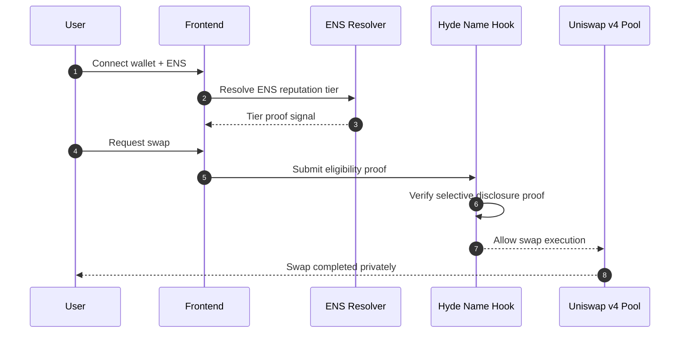
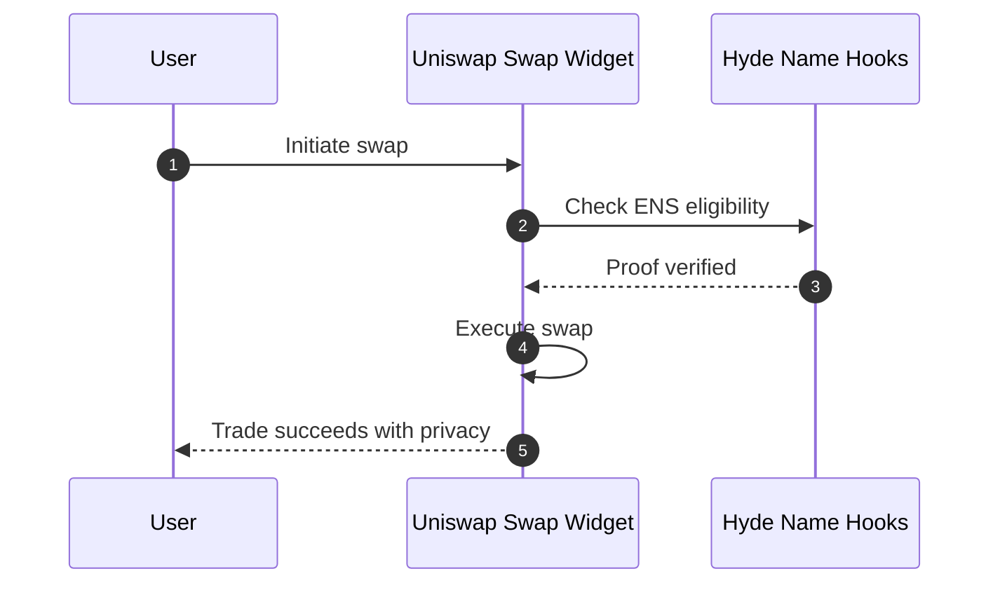

# Hyde Name Hooks

## Overview

Hyde Name Hooks is a privacy-preserving Uniswap v4 Hook framework that enables **selective disclosure swaps**.

Instead of revealing full wallet history, balances, or identity, users prove only what matters:

- “I am an ENS reputation tier ≥ X”
- “I am eligible to trade in this pool”

This creates a new primitive: **verifiable privacy with contextual identity**.

---

## Background & Market Context

### Why we started Hyde Name Hooks

Hyde Name Hooks began from a simple observation:

> DeFi is becoming global finance infrastructure, but it still leaks too much information.

In 2026, the biggest crypto trend is no longer just scaling or liquidity.
It is about **privacy, identity, and trust layers** that can support real-world adoption.

We designed Hyde because the market is converging on three realities:

1. **On-chain finance needs privacy to reach mainstream users**
2. **Privacy without accountability breaks market integrity**
3. **Identity primitives like ENS are evolving into reputation + context systems**

---

### Macro Trend: Privacy is the next missing layer

Ethereum’s roadmap increasingly treats privacy as a core requirement, not an optional feature.

- Users need protection from surveillance
- Protocols need verifiable integrity

Referenced resource:

- [Ethereum Roadmap — Privacy as a Public Good](https://ethereum.org/en/roadmap/privacy/)

Vitalik has also emphasized that future crypto applications must focus on **privacy-preserving mechanisms with legitimacy**, not pure anonymity.

- [Vitalik Buterin — Future Ideas on Privacy + Identity (2025)](https://vitalik.eth.limo/general/2025/08/12/ideas.html)

---

### Market Signal: Crypto 2026 will be about trust infrastructure

Major ecosystem investors highlight that the next wave is:

- programmable identity
- reputation
- privacy-first financial UX

Referenced resources:

- [a16z Crypto — Big Ideas We’re Excited About for 2026](https://a16zcrypto.com/posts/article/big-ideas-things-excited-about-crypto-2026/)
- [Coinbase Ventures — Ideas We Are Excited For in 2026](https://www.coinbase.com/blog/Coinbase-Ventures-Ideas-we-are-excited-for-in-2026)

These reports consistently point toward **context-aware identity + privacy rails** as the next category-defining primitive.

---

### DeFi Reality: Transparency creates extractive dynamics

Uniswap and open liquidity markets are powerful, but transparency introduces:

- MEV exploitation
- front-running
- strategy leakage

Referenced resource:

- [Flashbots — MEV and Transaction Privacy](https://www.flashbots.net/)

Uniswap v4 explicitly encourages new Hook designs that:

- reduce unnecessary information exposure
- preserve verifiability
- improve execution quality

- [Uniswap v4 Hooks Overview](https://docs.uniswap.org/contracts/v4/overview)

---

### ENS Evolution: Names are becoming programmable trust

ENS is no longer only a domain system.

It is increasingly used as:

- social identity
- wallet reputation anchor
- composable credential layer

Referenced resource:

- [ENS Documentation](https://docs.ens.domains/)

Hyde Name Hooks builds on this shift:

> Your ENS name is not just an address label.
> It becomes a contextual identity primitive that can gate privacy responsibly.

---

### Core Insight

The world does not need another swap UI.

The world needs:

- privacy that does not destroy accountability
- identity that does not reveal everything
- DeFi infrastructure that can support real users safely

That is why Hyde Name Hooks exists.

---

## Problem

Uniswap pools are open by design.

That means:

- Anyone can trade
- Anyone can sybil-spam pools
- Privacy solutions often remove accountability

The industry lacks a mechanism where:

- Trade details stay private
- Eligibility stays verifiable

---

## Solution

Hyde Name Hooks introduces two combined primitives:

### 1. Selective Disclosure Hook

Users hide trade details, but prove eligibility.

Only minimal signals are revealed:

- Trusted tier
- Reputation score threshold

### 2. ENS Context Gating Hook

ENS names become programmable trust identities.

Example:

- Only ENS holders with reputation tier ≥ Bronze can swap
- Prevents sybil privacy pool abuse

---

## Key Features

- **Selective disclosure privacy swaps**
- **ENS-based contextual reputation tiers**
- **Sybil resistance for privacy pools**
- **Uniswap v4 Hook integration**
- **Verifiable on-chain eligibility**

---

## Platform Architecture



---

## User Flow



---

## ENS Integration

Hyde leverages ENS as more than naming.

ENS provides:

- Human-readable identity
- Reputation context
- Programmable gating signals

Resources:

- [ENS Documentation](https://docs.ens.domains/)

---

## Uniswap v4 Integration

Hyde Name Hooks integrates directly into Uniswap v4 lifecycle:

- `beforeSwap()` verifies eligibility proof
- Swap proceeds only if reputation tier is valid

Key references:

- [Uniswap v4 Hook Templates](https://github.com/uniswapfoundation/v4-template)
- [OpenZeppelin Hook Libraries](https://docs.openzeppelin.com/contracts/)

---

## Technical Deep Dive

### Context Scoring Pipeline

- Backend computes a 0–1000 score from on-chain signals:
  - transaction history (0–300)
  - token holdings (0–300)
  - DeFi activity (0–200)
  - DAO participation (0–200)
- Score is mapped to tier (Standard/Trusted/Elite)
- Only tier is stored on-chain to preserve privacy

### On-Chain Registry

- `ENSContextRegistry` stores:
  - `ensNameHash` (keccak256)
  - tier level
  - last update timestamp
- Registry is updated only by the backend oracle

### Hook Gating (v4)

- `HydeHook` checks:
  - user is registered
  - tier >= required tier
  - cooldown not violated
- Fails fast on any violation and emits denial reasons

### API Surface

- `POST /api/verify-ens` → verify ownership + register tier
- `GET /api/tier/:address` → read tier for UI gating
- `GET /api/ens-name/:address` → reverse lookup for display

---

## Hackathon Demo

Our demo site embeds:

- Uniswap Swap Widget
- Hyde Name Hook verification layer

Flow:

1. User initiates swap
2. Hyde verifies ENS tier + proof
3. Swap executes only after validation

---

## Vision

Hyde Name Hooks is a step toward:

- Responsible privacy in DeFi
- Contextual identity-based access control
- Sybil-resistant privacy pools

Privacy should not mean anonymity without accountability.

Hyde makes privacy programmable.

---

## Repository Structure (Planned)

- `contracts/` Hyde Hook smart contracts
- `frontend/` Demo swap widget integration
- `circuits/` Proof + selective disclosure logic
- `docs/` Architecture + design specs

## Quick Start

### Prerequisites
- Node.js 18+
- MetaMask or compatible wallet
- Alchemy/Infura API key (for ENS data)

### 1. Install Dependencies

```bash
# Frontend
cd frontend
npm install

# Contracts
cd ../contracts
npm install

# Backend
cd ../backend
npm install
```

### 2. Deploy Contracts

```bash
cd contracts

# Start local Hardhat node
npx hardhat node

# Deploy (in another terminal)
npm run deploy:local
```

Copy the deployed contract addresses.

### 3. Configure Backend

```bash
cd backend
cp .env.example .env
```

Edit `.env`:
```env
PORT=3001
SEPOLIA_RPC_URL=https://eth-sepolia.g.alchemy.com/v2/YOUR_KEY
REGISTRY_CONTRACT_ADDRESS=<from deployment>
BACKEND_PRIVATE_KEY=<your backend wallet>
FRONTEND_URL=http://localhost:5173
```

Start backend:
```bash
npm run dev
```

### 4. Run Frontend

```bash
cd frontend
npm run dev
```

Visit `http://localhost:5173`

## Features

### ✨ Selective Disclosure
- Prove tier (Standard/Trusted/Elite) without revealing exact score
- On-chain context tied to ENS names
- Privacy-preserving event logs

### 🔐 Tier-Based Access
- **Standard** (0-799): Open pools
- **Trusted** (800-899): Privacy-enhanced pools
- **Elite** (900-1000): Premium pools with best execution

### 🎯 ENS Context Scoring
Factors (0-1000 points):
1. Transaction history (0-300)
2. Token holdings (0-300)
3. DeFi activity (0-200)
4. DAO participation (0-200)

### 🛡️ MEV Protection
- Tier gating reduces sandwich attacks
- Cooldown mechanisms prevent bot abuse
- Execution privacy via Hook layer

## Project Structure

```
HNH Test/
├── frontend/          # React app
│   ├── src/
│   │   ├── pages/     # LandingPage, VerifyPage, etc.
│   │   ├── components/
│   │   └── contexts/
│   └── package.json
│
├── contracts/         # Solidity contracts
│   ├── src/
│   │   ├── ENSContextRegistry.sol
│   │   └── HydeHook.sol
│   ├── test/
│   └── scripts/
│
└── backend/           # Express API
    ├── src/
    │   ├── services/  # ENS scoring, contract calls
    │   ├── routes/    # API endpoints
    │   └── index.ts
    └── package.json
```

## Testing

### Smart Contracts
```bash
cd contracts
npx hardhat test
npx hardhat coverage
```

### Backend
```bash
cd backend
npm test
```

### Frontend
```bash
cd frontend
npm test
```

## Deployment

### Testnet (Sepolia)
```bash
cd contracts
npm run deploy:sepolia
```

### Backend
```bash
cd backend
npm run build
npm start
```

### Frontend
```bash
cd frontend
npm run build
# Deploy /dist to Vercel, Netlify, etc.
```

## Security Considerations

- ✅ Tier storage uses hashed ENS names for privacy
- ✅ Only backend oracle can update tiers
- ✅ Cooldown periods prevent abuse
- ✅ No raw scores exposed in UI or events
- ⚠️ Backend private key must be secured
- ⚠️ Oracle centralization (future: decentralize via DAO)

## Roadmap

- [ ] Deploy to Sepolia testnet
- [ ] Complete Uniswap v4 Hook integration
- [ ] Implement zkProofs for tier verification
- [ ] Add liquidity incentives for privacy pools
- [ ] DAO governance for tier thresholds
- [ ] Mainnet launch

## License

MIT

## Contact

Built for the HNH Hackathon - Selective Disclosure Execution Privacy
